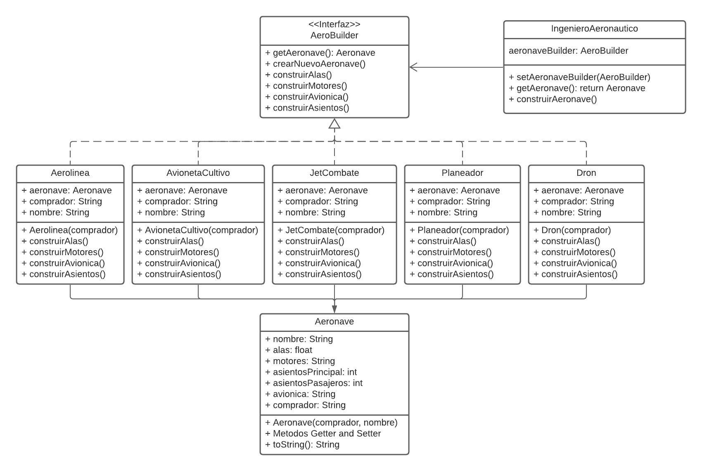
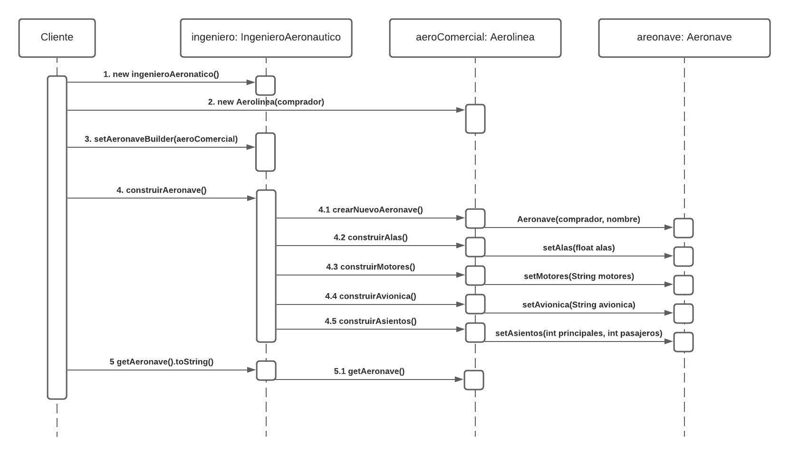

# AeroBuilder
Example about Aeronautical Company with Builder Pattern on Java/Netbeans

>*The Aeronautical Company "A.F.N.D." want to make a catalog in a program of your aircrafts, however, when implementing it, you faced the problem of the **telescopic constructor**, since some of your products do not have Avionics and / or Seats but several do, how to solve it. that? (Builder Pattern)*

 | Class Diagram    | Sequence Diagram (only aeroComercial case)        | 
:-------------------------:|:-------------------------:
|   |  |

**Use:**
* NetBeans IDE 12.0 
* Java Development Kit (JDK) 13

**Finished:** *Febrary - 2021*